# Resume API

A REST API for an AI Resume Builder built using **Node.js** and **Express.js**.

This project provides RESTful endpoints for managing users, resumes, resume sections, templates, AI-powered writing assistance, ATS checking, resume tailoring, exporting, and sharing. The API follows REST architecture and uses **JSON** for data exchange.

---

## Tech Stack

- Node.js
- Express.js
- JavaScript
- JSON File Storage
- Postman

---

## Features

- User Authentication
- User Management
- Resume Documents
- Resume Sections
- Section Items
- Resume Versions
- Resume Templates
- AI Writing
- ATS Resume Check
- Resume Tailoring
- Resume Export
- Resume Sharing
- Job Applications

---

## Project Structure

```text
resume-api/
├── controllers/
├── middleware/
├── models/
├── routes/
├── screenshots/
├── data.json
├── app.js
├── package.json
└── README.md
```

### Folder Description

| Folder | Description |
|---------|-------------|
| controllers | Contains business logic for handling API requests and responses. |
| middleware | Stores reusable middleware such as authentication and request validation. |
| models | Defines the application's data structure. |
| routes | Contains all REST API endpoint definitions. |
| screenshots | Stores Postman API testing screenshots. |
| data.json | JSON-based data storage used by the application. |
| app.js | Entry point of the Express server. |

---

## API Resources

The API provides the following resources:

- Authentication
- Users
- Documents
- Sections
- Section Items
- Versions
- Templates
- AI Writing
- ATS Check
- Tailoring
- Export
- Share
- Applications

Each resource follows RESTful principles using HTTP methods such as **GET**, **POST**, **PUT**, and **DELETE**.

---

## Installation

Clone the repository

```bash
git clone <repository-url>
```

Navigate to the project directory

```bash
cd resume-api
```

Install dependencies

```bash
npm install
```

Start the server

```bash
npm start
```

The server will run at:

```text
http://localhost:3000
```

---

## API Testing

All API endpoints were tested using **Postman**.

### Register

Creates a new user account.

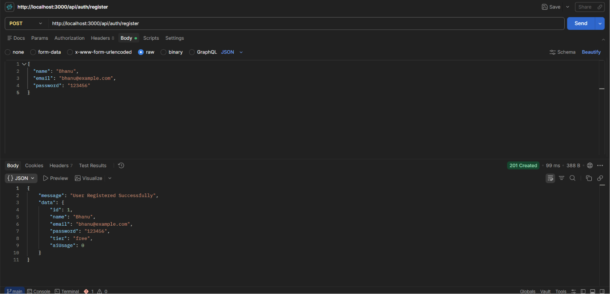

### Login

Authenticates an existing user.

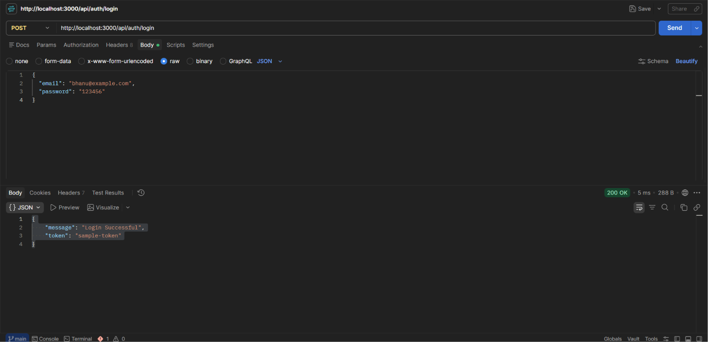

### User Profile

Retrieves the authenticated user's profile information.

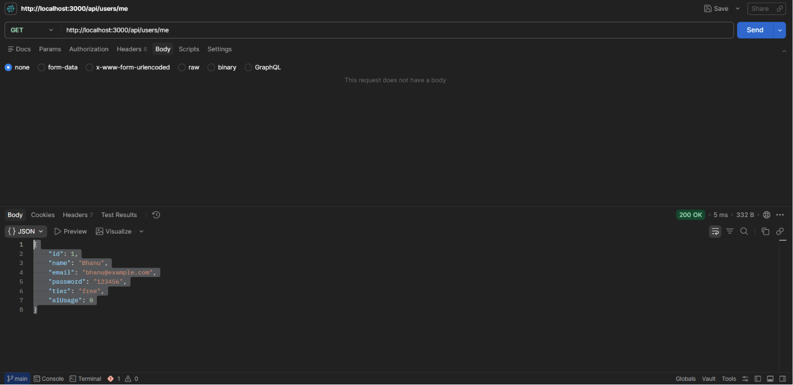

### Create Document

Creates a new resume document.

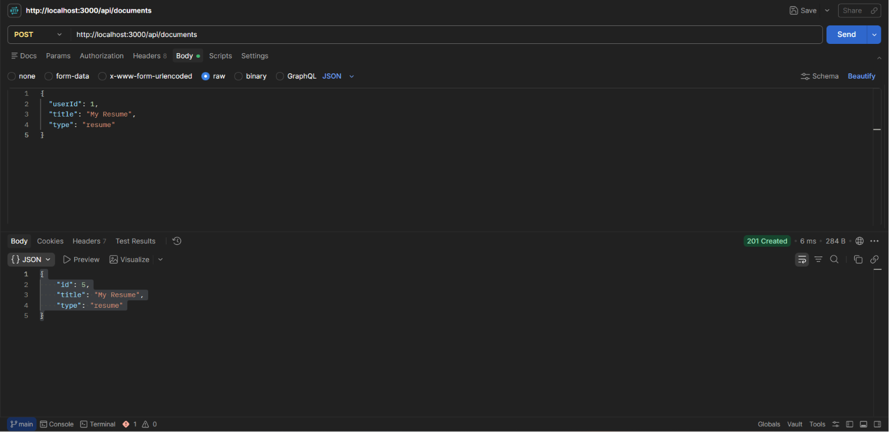

### Create Section

Adds a new section to a resume.

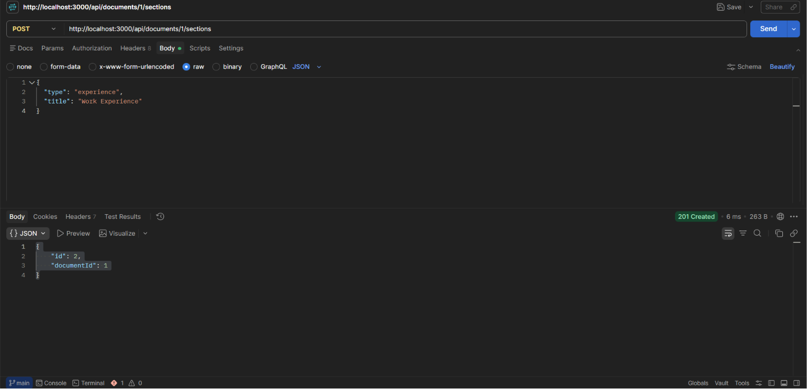

### Create Section Item

Adds content to a specific resume section.

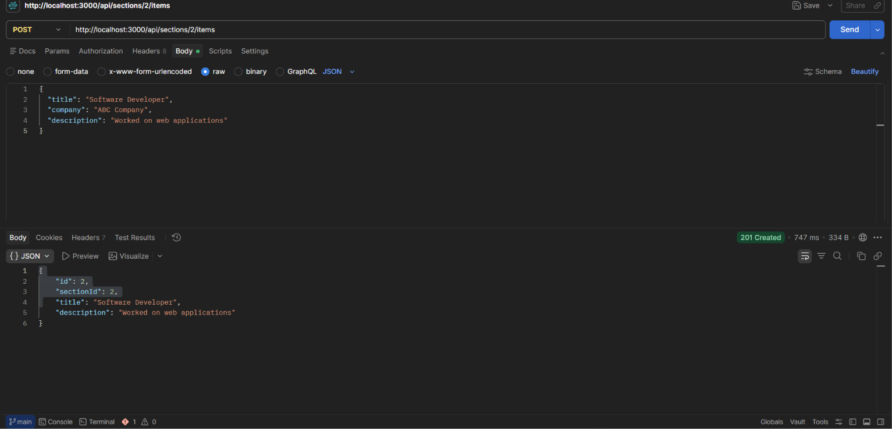

### Create Version

Creates a new version of the resume.

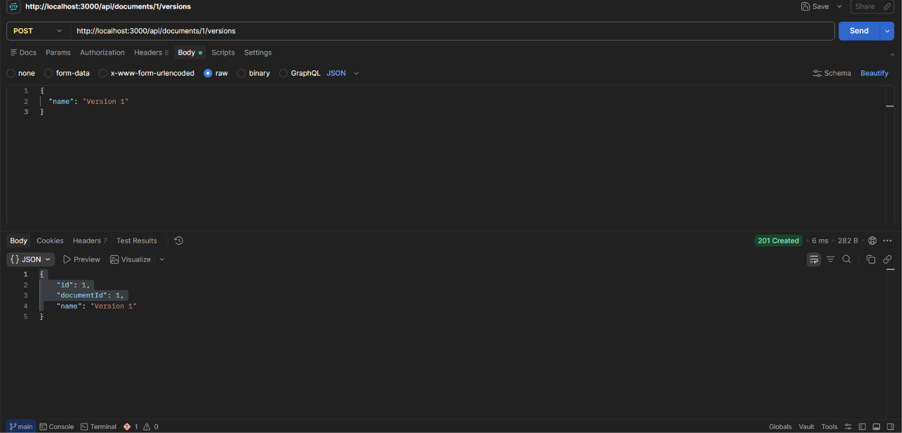

### Get Templates

Retrieves the available resume templates.

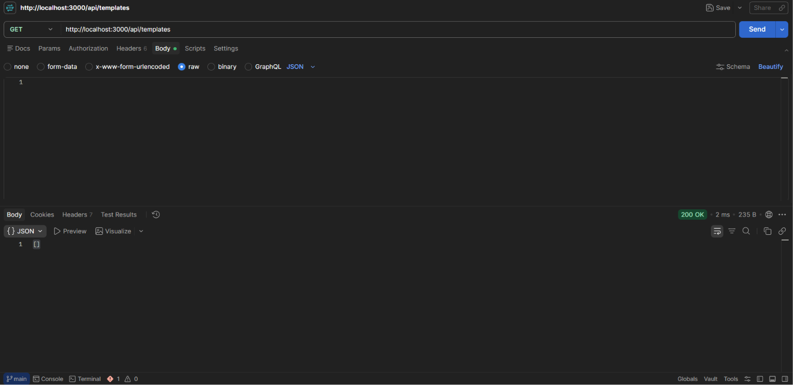

### AI Writing

Generates AI-assisted content for resume sections.

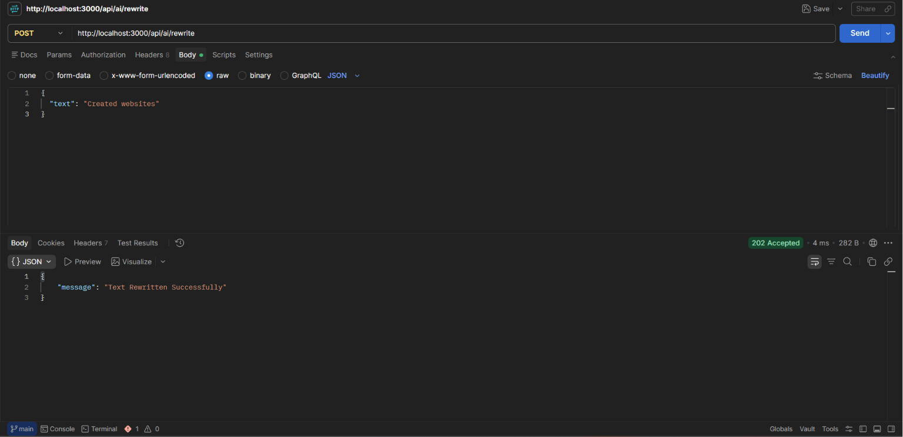

### ATS Check

Analyzes the resume for ATS compatibility.

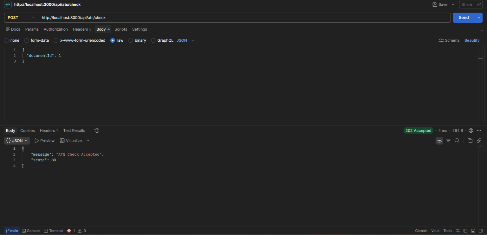

### Tailoring

Customizes the resume according to a job description.

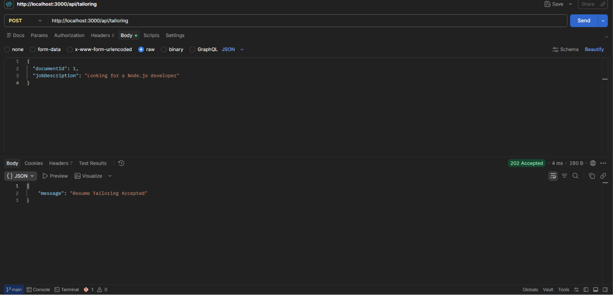

### Export

Exports the resume in the requested format.

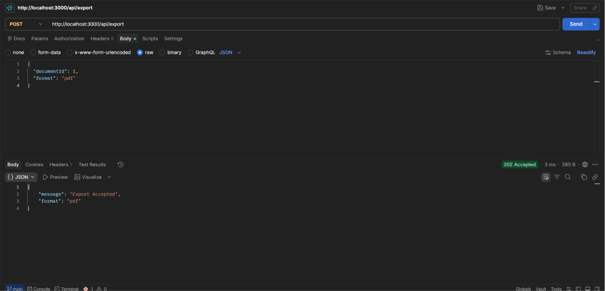

### Share Document

Generates a shareable link for the resume.

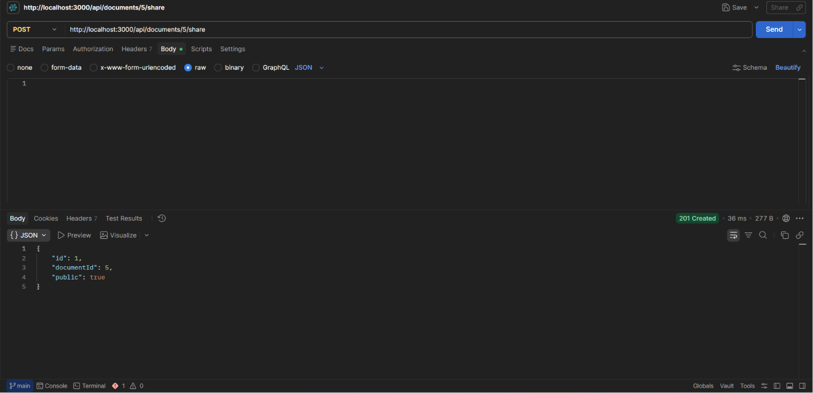

---

## Author

**Bhanu Joshi**

GitHub: https://github.com/bhanu-joshi01